# FINAL-PJT

## 목차

- 팀원 정보 및 업무 분담 내역 
- 목표 서비스 구현 및 실제 구현 정도
- 데이터베이스 모델링(ERD) 
- 필수 기능에 대한 설명 
- 배포 서버 URL 
- 느낀점
- 앞으로 해결해야 할 문제


## 1. 팀원 정보 및 업무 분담 내역 

### 김민재

- 초반에는 네비게이터와 드라이버 방식으로 프로젝트를 진행해 나아가다가 
- 백엔드 부분을 하였습니다.

### 정준호

- 프론트엔드를 맡았습니다.


## 2. 목표 서비스 구현 및 실제 구현 정도 

### 목표 서비스 구현

>1. 첫 화면
>   1. 전체 영화 주제별로 정리한 후, carousel
>   2. 영화 페이지를 눌렀을 때 하단에 영화에 대한 정보 페이지가 떠야 함.
>   3. 모달을 클릭했을 때,
>      1. Basic
>         1. movie Description
>         2. 로그인한 유저들을 대상으로 한 찜버튼
>         3. 로그인한 유저들을 대상으로 한 영화 평점 매길 수 있는 버튼
>      2. Detail
>         1. 로그인한 유저들을 대상으로 한 영화에 대한 리뷰 게시 가능
>         2. 로그인한 유저들을 대상으로 한 리뷰에 대한 게시 가능
>      3. REC
>         1. 영화 추천. TMDB에 추천 API를 통해 세 가지 영화를 보여줌.
>2. 영화 추천을 하는 기능을 구현한다면, 사용자가 매긴 평점을 통해 추천.
>3. 워드클라우드, 평점 막대그래프


### 실제 서비스 구현

1. 첫 화면
   1. 전체 영화 주제별로 정리한 후, carousel
   2. 영화 페이지를 눌렀을 때 하단에 영화에 대한 정보 페이지가 떠야 함.
   3. 모달을 클릭했을 때,
      1. Basic
         1. movie Description
         2. 로그인한 유저들을 대상으로 한 찜버튼
         3. 로그인한 유저들을 대상으로 한 영화 평점 매길 수 있는 버튼
      2. Detail
         1. 로그인한 유저들을 대상으로 한 영화에 대한 리뷰 게시 가능
         2. 로그인한 유저들을 대상으로 한 리뷰에 대한 게시 가능
      3. REC
         1. 영화 추천. TMDB에 추천 API를 통해 세 가지 영화를 보여줌.
2. 마이페이지엔 찜한 영화들의 장르를 대상으로 워드클라우드 구성
3. 추천작 페이지엔 찜한 영화들의 장르를 바탕으로 같은 장르를 갖고 있는 영화 중에 랜덤으로 추천. (추천페이지)


## 3. 데이터베이스 모델링(ERD) 

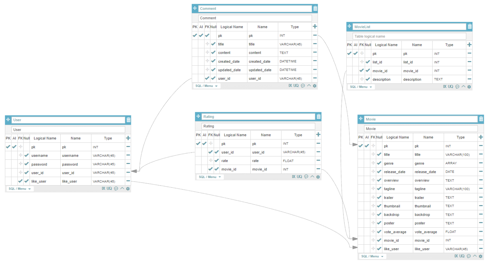


## 4. 필수 기능에 대한 설명

### 1. 관리자 뷰 

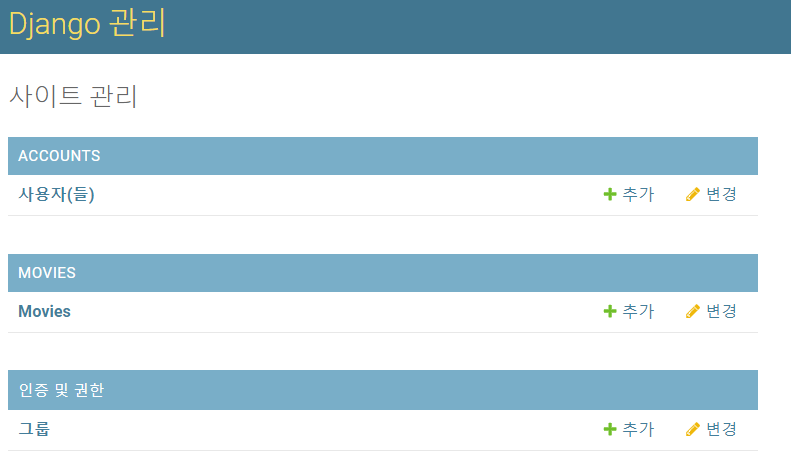

```python
from django.contrib import admin
from .models import Movie

# Register your models here.

admin.site.register(Movie)
```

> movies/admin.py에 다음과 같은 코드 작성


### 2. 영화 정보

`영화 정보는 Database Seeding을 활용하여 최소 50개 이상의 데이터가 존재 하도록 구성해야 합니다. `

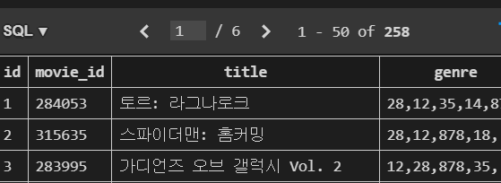

> 총 258개의 영화로 구성


`모든 로그인 된 유저는 영화에 대한 평점 등록 / 수정 / 삭제 등을 할 수 있 어야 합니다. `

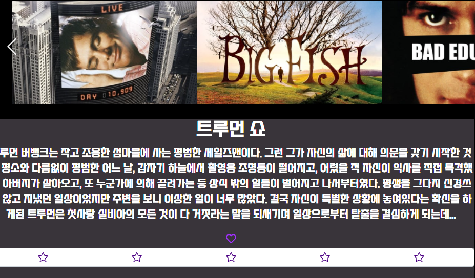

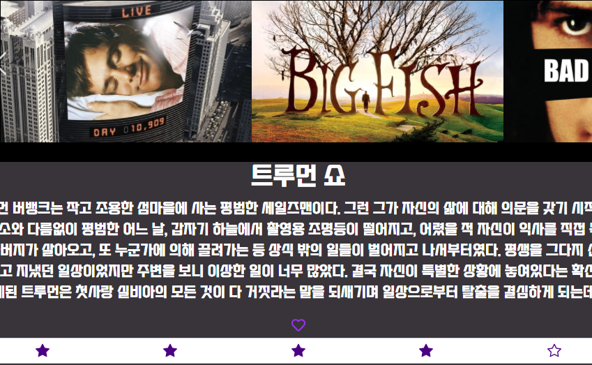

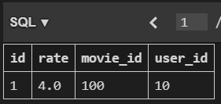

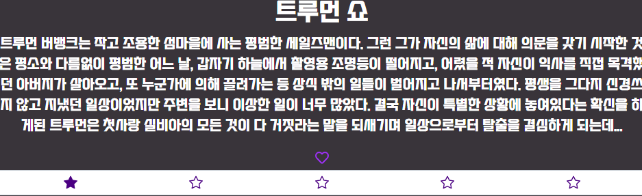

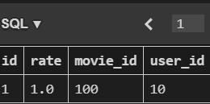

> 평점이 생성되고 갱신될 때마다 db 역시 update


### 3. 추천 알고리즘

> 유저가 그간 찜한 영화들의 장르들을 바탕으로 그 장르를 가진 타 영화 추천.

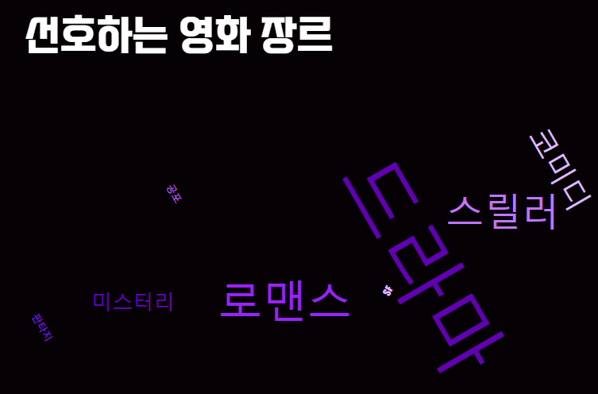

> 드라마를 선호하는 유저..

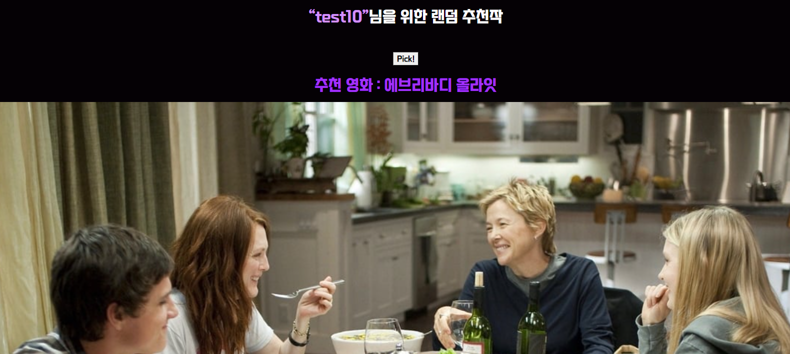

> 드라마 장르를 가진 영화들을 랜덤으로 추천하도록 함.
>
> 찜한 영화가 없을 경우엔,,


> 찜한 영화가 없다는 문구를 보여주고 pick 버튼을 가림


### 4. 커뮤니티

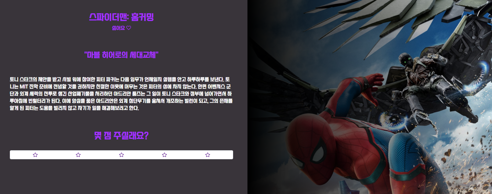

> 기본정보 페이지

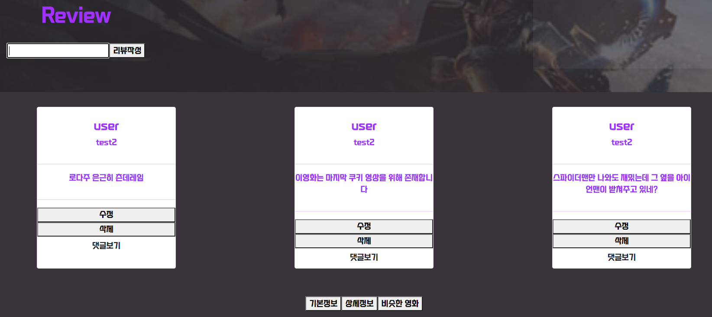

> 선택한 영화의 상세정보 란에서 커뮤니티를 구성하고 있음.

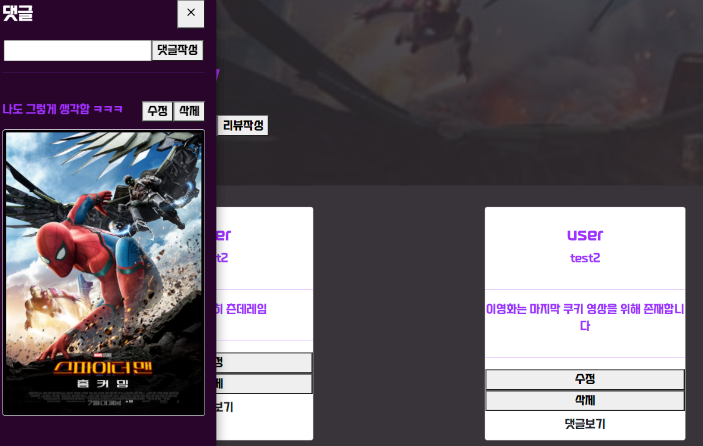

> 댓글 보기 버튼을 클릭하면 토글 사이드바가 나타나며 대댓글을 달 수 있음.

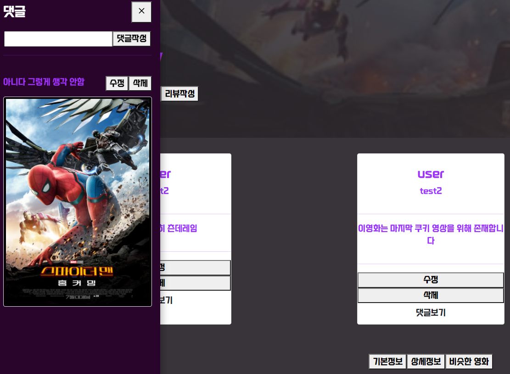

> 댓글 수정

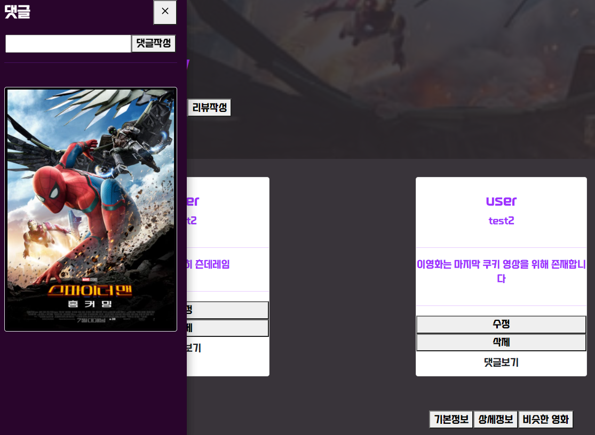

> 댓글 삭제

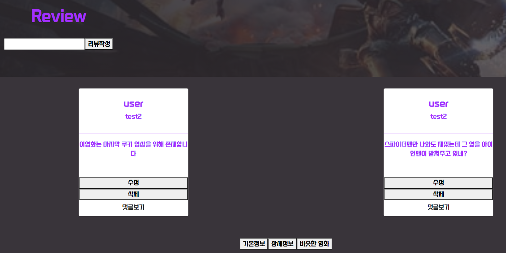

> 리뷰 삭제

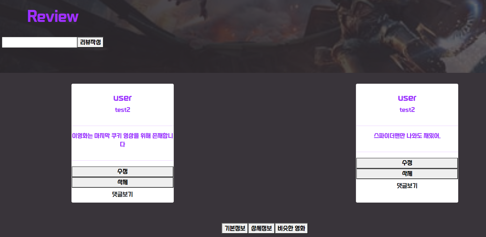

> 리뷰 수정


### 5. 기타

`최소한 5개 이상의 URL 및 페이지를 구성해야 합니다. `

> movies/urls.py

```python
from django.urls import path
from . import views


urlpatterns = [
    path('', views.movie_list_create),
    path('movie_list/', views.movie_list),
    path('<int:movie_id>/likes/', views.likes),
    path('<int:movie_id>/review_list/', views.review_list),
    path('<int:movie_id>/review_create/', views.review_create),
    path('reviews/<int:comment_pk>/', views.review_update_delete),
    path('reviews/<int:comment_pk>/reply_list/', views.reply_list),
    path('reviews/<int:comment_pk>/reply_create/', views.reply_create),
    path('replies/<int:reply_pk>/', views.reply_update_delete),
    path('<int:movie_id>/rating/', views.movie_rate),
    # path('tmp/', views.tmp),
]
```

> accounts/urls.py

```python
from rest_framework_jwt.views import obtain_jwt_token

from django.urls import path
from . import views


urlpatterns = [
    path('signup/', views.signup),
    path('api-token-auth/', obtain_jwt_token),
    path('', views.profile),
]
```


`HTTP Method와 상태 코드는 상황에 맞게 적절하게 반환되어야 하며, 필요에 따라 메시지 프레임워크 등을 사용하여 에러 페이지를 구성해야 합니다. `

> movies/views.py 중 일부

```python
@api_view(['POST'])
@authentication_classes([JSONWebTokenAuthentication])
@permission_classes([IsAuthenticated])
def review_create(request, movie_id):
    movie = get_object_or_404(Movie, movie_id=movie_id)
    request.data['username'] = request.user.username
    serializer = CommentSerializer(data=request.data)
    if serializer.is_valid(raise_exception=True):
        serializer.save(movie=movie, user=request.user)
        return Response(serializer.data, status=status.HTTP_201_CREATED)
    return Response(status=status.HTTP_401_UNAUTHORIZED)
```


## 5. 느낀점

- 이 프로젝트를 해보면서 협업의 방향을 잡을 수 있게 되었다.
- 후반부 수업(javascript~) 때는 제대로 정리하지 못한 것들을 이번 프로젝트를 하면서 정리할 수 있었다.
- 웹 개발에 대한 막연한 두려움이 있었는데, 프로페셔널한 교수님께서 하나부터 열까지 이해가 되도록 가르쳐 주셨다. 감사합니다. 교수님. 덕분에 많이 성장할 수 있었습니다.


## 6. 앞으로 해결해야 할 문제

- 평점 기록해 둔 db를 갖고 추천 알고리즘 확장.